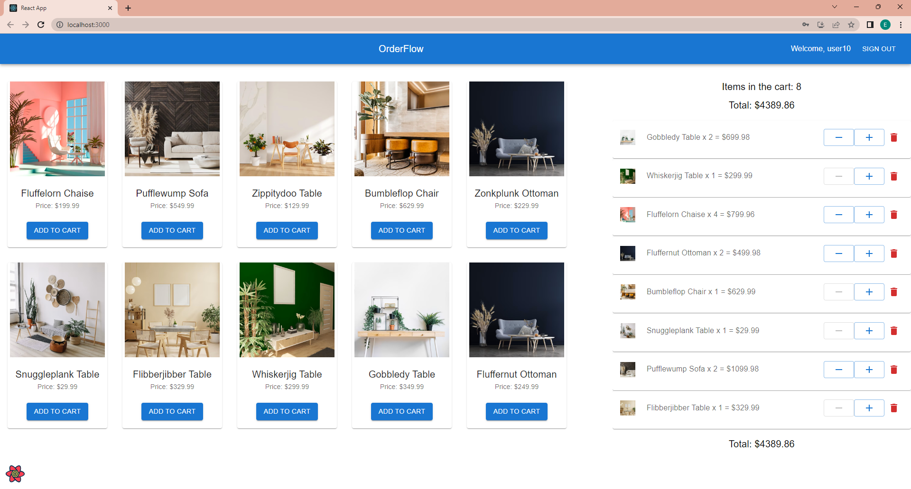

# OrderFlow

## Overview

A web shop themed project with focus on test automation. The Docker-containerised backend uses Linux, PostgreSQL, Django and exposes a REST API consumed by React frontend.

Testing modes:

- API, manual (Postman)
- API, automated (Cypress/TypeScript)
- Web UI, manual
- Web UI, automated (Selenium/Python)

A CI pipeline (GitHub Actions) runs the Cypress and Selenium tests.



## Authentication

The user is required to register using the registration form (username, password, email are passed to the /api/register/ endpoint). All other endpoints expect a JWT token to be sent in request header. The token itself is requested from the /api/token/ endpoint, passing username and password.

## Backend: Postgres, Django

The project's backend is running as two Docker containers, a Postgres DBMS and a Django web server. The containers are launched by Docker Compose.

Django REST Framework is used to implement a REST API with these endpoints/methods:

```
- /api/register/         POST
- /api/token/            POST
- /api/token/refresh/    POST
- /api/products/         GET
- /api/products/1/       GET
- /api/orders/           GET
- /api/cart/items/       GET POST
- /api/cart/items/1/     GET PUT DELETE
```

## Frontend: React

The frontend is a React/TypeScript single-page application that uses Material UI, React Query and axios.

The web shop website is implemented as the following components:

- RegistrationForm.tsx
- LoginForm.tsx
- Layout.tsx
- Header.tsx
- ProductsContainer.tsx
- ProductCard.tsx
- CartItemsContainer.tsx
- CartItem.tsx

## API Test Automation: Cypress

The Cypress framework is used to implement automated tests for the REST API:

- GET should fetch at least 1 product from the /api/products/ endpoint
- GET should fetch product details from the /api/products/1/ endpoint
- GET should fetch 1 order from the /api/orders/ endpoint
- POST should add item to cart and GET should fetch last cart item from the /api/cart/items/ endpoint
- PUT should modify quantity of a cart item using the /api/cart/items/1/ endpoint
- DELETE should remove a cart item using the /api/cart/items/1/ endpoint

## Web UI Test Automation: Selenium

The Selenium and pytest frameworks are used to implement end-to-end test automation.

## CI Pipeline

A GitHub Actions workflow is configured to be triggered by a push to any branch.

The workflow has the following steps:

- Set up Python
- Install backend (Python) dependencies
- Setup Node.js
- Install frontend dependencies
- Start backend
- Run API Tests (Cypress)
- Start frontend
- Run UI Tests (pytest/Selenium)
